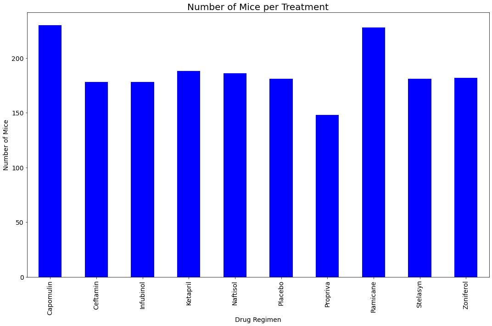
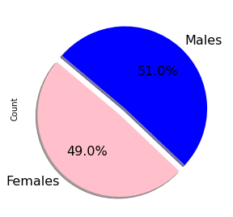
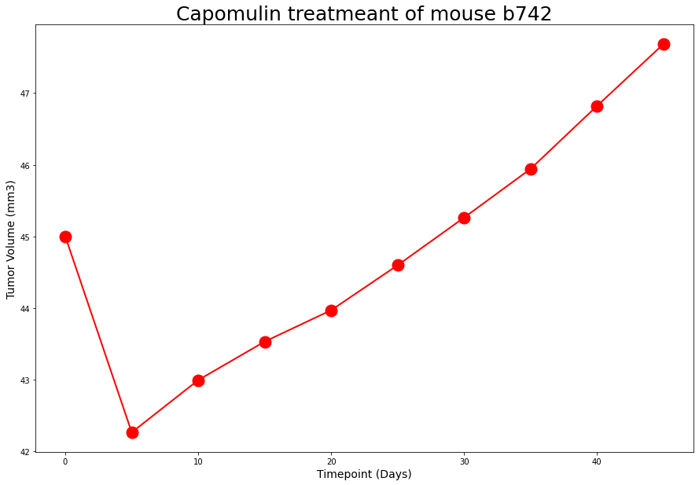
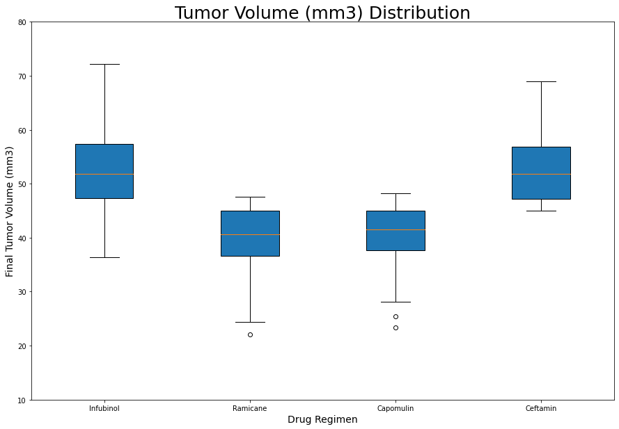
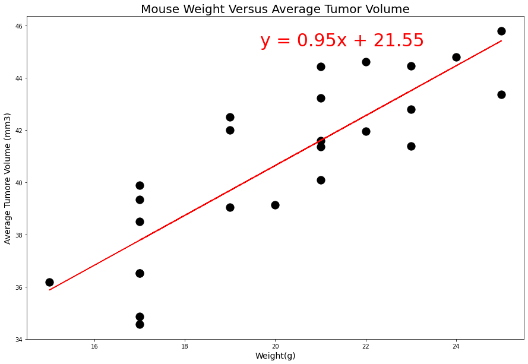

# matplotlib-challenge
The Power of Plots

In this challenge, the power of matplotlib, pandas, scipy, and python were used to generate valuable insights from a dataset containing research data in a pharmecutical trial on mice with tumors (what kind of tumor, it does not say!)

<title>Summary Statistics</title>

<title>Bar Plot</title>

<title>Pie Chart</title>

<title>Line Plot</title>

<title>Scatter Plot</title>

<title>Box Plot</title>

<title>Correlation Plot</title>

