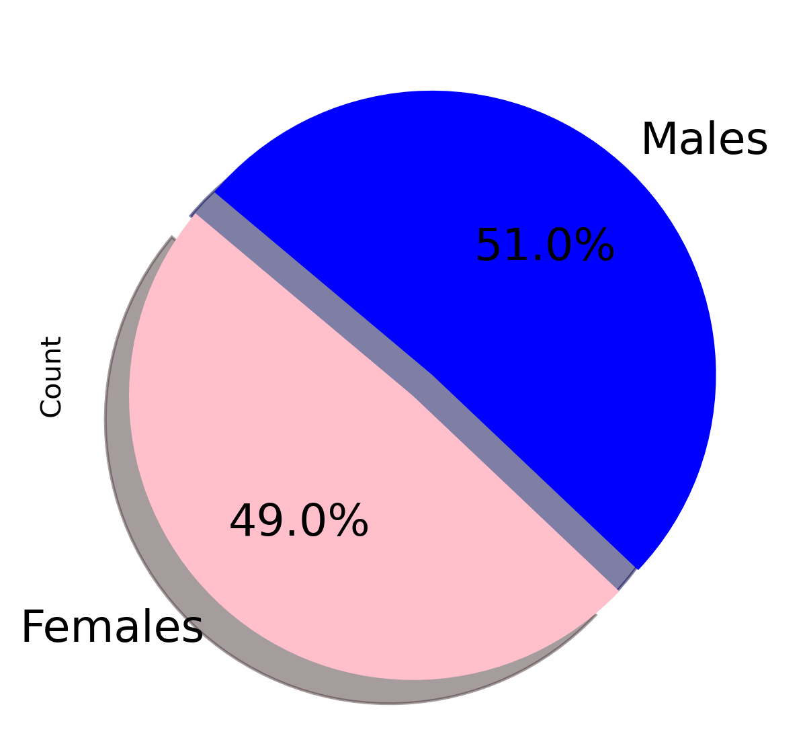
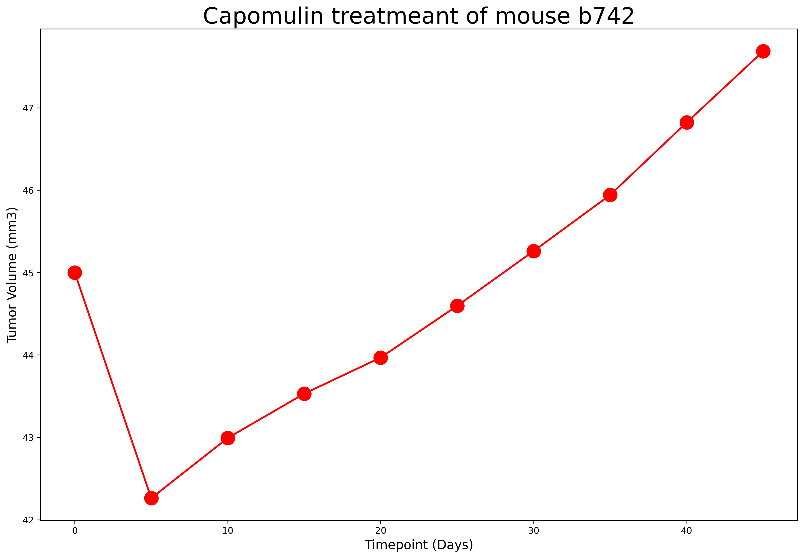
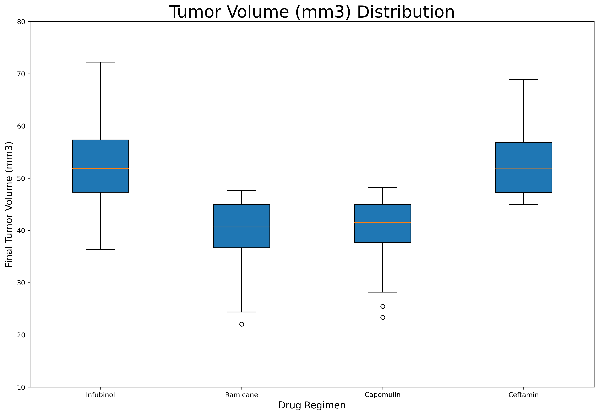
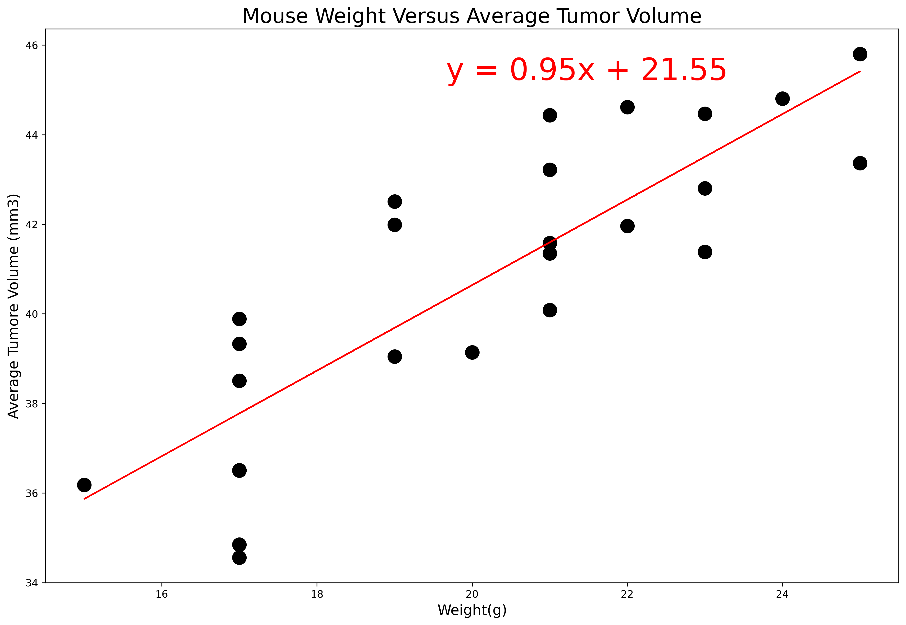

# matplotlib-challenge
The Power of Plots

In this challenge, the power of matplotlib, pandas, scipy, and python were used to generate valuable insights from a dataset containing research data in a pharmecutical trial on mice with tumors.

## Observations and Insights

1. According to the bar plot, the dataset contains the most data from drug regimens Capomulin and Ramicane.

2. This study had a pretty even sample size of male and female mice, with males being 51% of the study and females being 49%.

3. Capomulin has the lowest average tumor volume. This would make it seem that it's the most successful regimen in the trial, but with 2 outliers with very low tumor volumes, this sends the average down.

4. Median tumor volume of mice in the Capomulin trial is drastically lower than th other drugs, so with the low mean and low median, and a low standard deviation in comparison to the rest of the dataset. We can conclude that Capomulin is the most successful drug out of the 10 regimens in the study.

### Summary Statistics 

### Bar Plot

### Pie Chart

### Line Plot

### Scatter Plot

### Box Plot

### Correlation Plot

